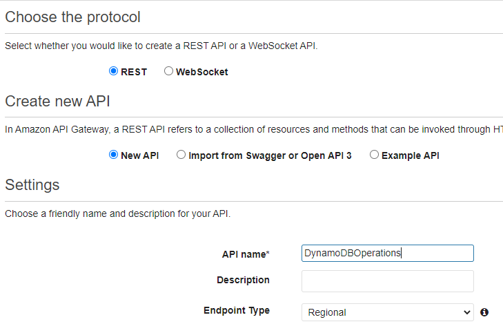

# Create a serverless DynamoDB app with Lambda function for CRUD operations.

In this project, I have built a serverless DynamoDB application. A new API is built that takes POST requests from the client and passes it on to the lambda function which handles the CRUD operations on the DynamoDB table. The API is tested using Postman and then CRUD operations are passed as jsons.

## 1. Setup the IAM role. 

Role lambda-api-gateway has been set allowing Lambda entity access to DynamoDB and CloudWatch.

## 2. Create the lambda function.

Create the lambda function.

Select role for the lambda function.

Create the function.

Write the code for the lambda function.

## 3. Create a Test Event.

Create a test event with the following json.

Run the test event.

## 4. Create a table in DynamoDB.

Create table lambdaapi-gateway with id as the partition key.

## 5. Create an API.

Select the REST API.

Create a new API with DynamoDBOperations as its name.

## 6. Create a child resource and integrate lambda function with its post method.

Press actions and create a new child resource DynamoDBManager.

Press the created resource DynamoDBManager and create a new post method.

Integrate the lambda function with the post method.

## 7. Create a stage and copy its invocation url.

Press actions and create a stage Prod.

Copy the invocation url.

## 8. Run Postman and test the API.

Create a new POST HttpRequest in Postman. Paste the copied invocation url and write a JSON event for a create operation.

Check the AWS DynamoDB table for item.

Send scan request from Postman to receive a response with the added item.

