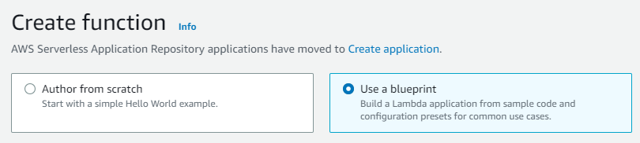
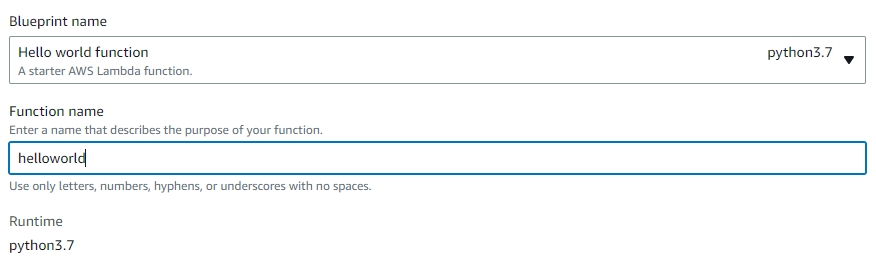
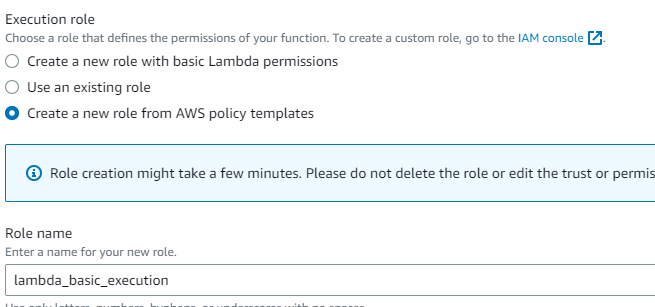
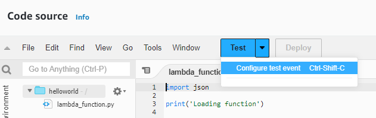
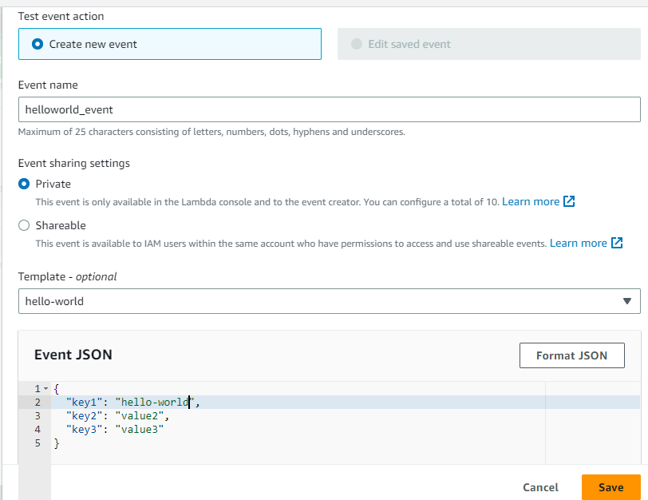
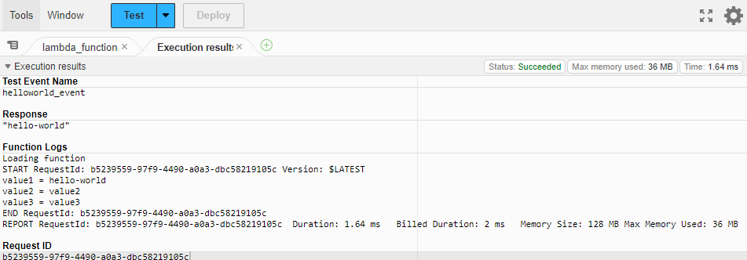
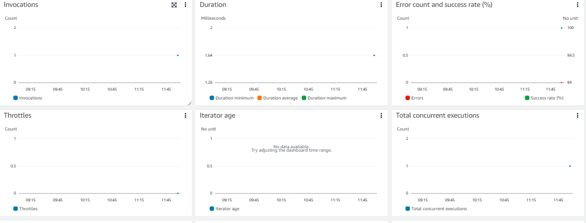
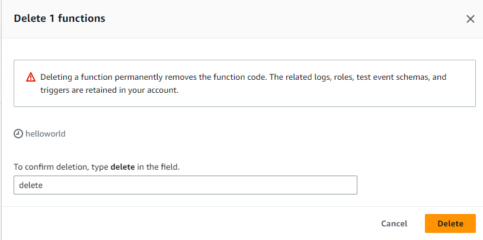

# First Lambda Program

## **1. Create Lambda program.**

Open Lambda Dashboard. 

Click on select blueprint.

Choose the python version of the hello world blueprint and provide a name to the function.

Assign a basic role to lambda function.

Create the function.

## **2. Configure the test event**.

Create new test event helloworld_event and replace "value1" with "hello-world"

Click Test.
Event tested and hello-world output received from the lambda code.

## **3. Viewing the metrics using CloudWatch**

Invoke the function a few more times.

Monitor the results.

## **4. Deleting the lambda function**

