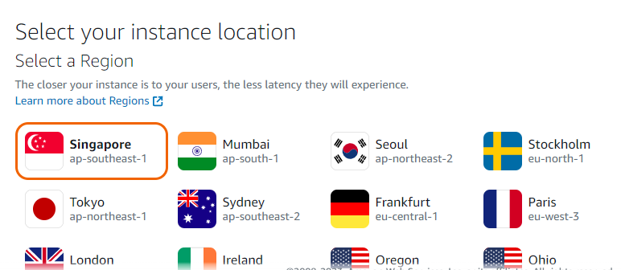
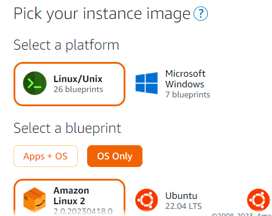
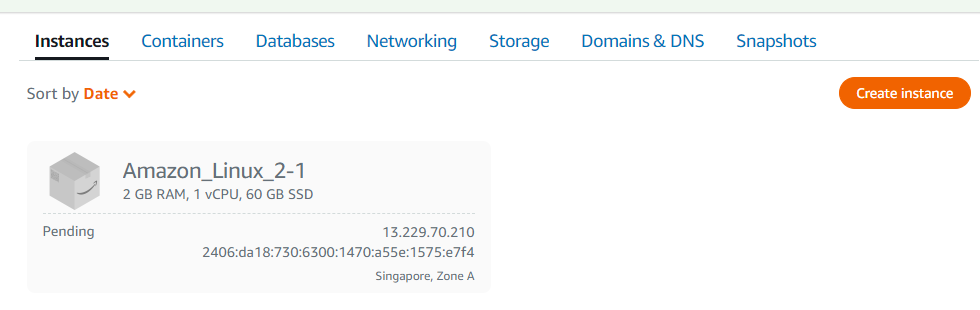
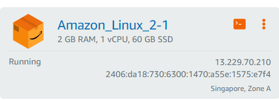
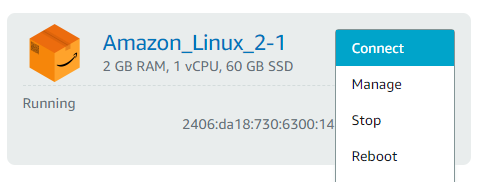
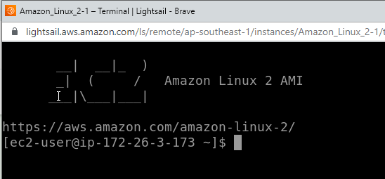

# Creating a virtual Linux machine in LightSail

## 1.Choose location and os.

## 2.Choose OS only and pick the Amazon Linux 2 blueprint

## 3.Select plan

## 4.Create instance 

Instance Pending 

Instance Running 

## 5.Connect to instance

 

## 6. Successfully Connected

