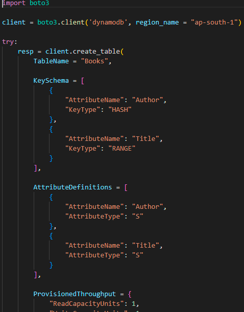
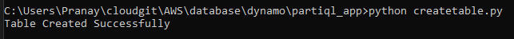
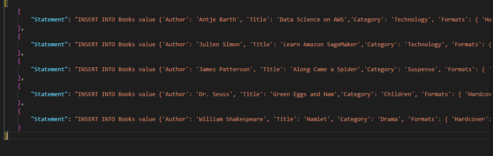
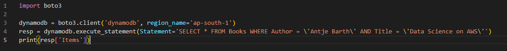

# Creating a DynamoDB PartiQL application

## 1 . Create table

Create a table using python boto. Boto is a python AWS SDK.

Table is created.

## 2. Create a file partiqlbatch.json

## 3. Create a query file

