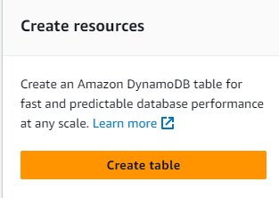
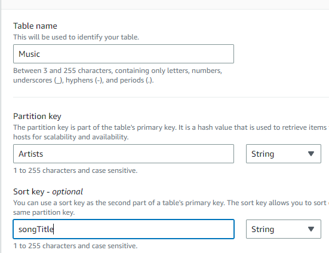
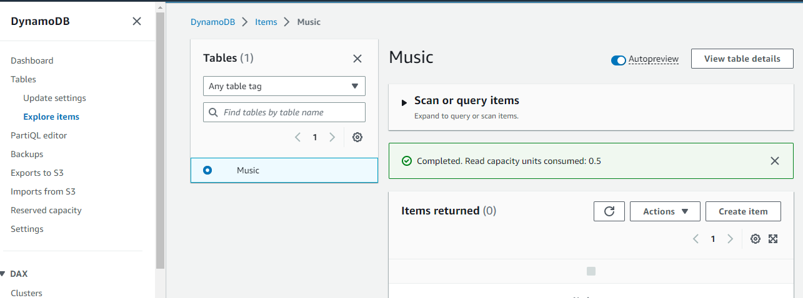
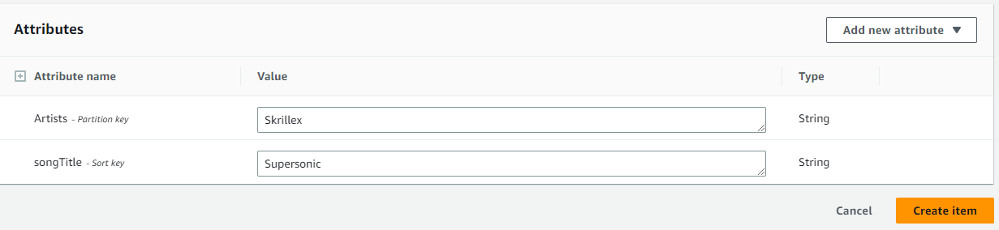
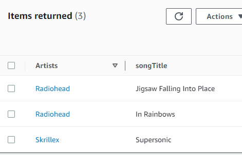

# Using NoSQL databases

## 1. Create the database

Go to DynamoDB page. Press the create button.

Enter the partition key and the sorting key. 

Create the table. 

## 2. Add Items

Go to the explore items page. Select the created database.
 

Create database items.

Items created.

